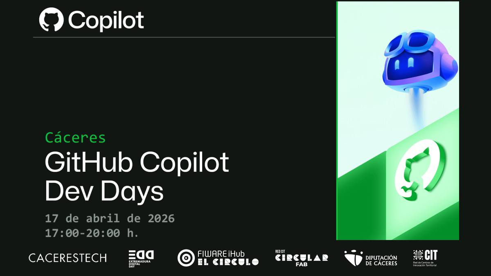

# GitHub Copilot Developer Days — Terminal Edition

Bienvenido a **GitHub Copilot Developer Days — Terminal Edition**, un evento presencial diseñado para ayudar a desarrolladores de todos los niveles a descubrir, aprender y construir con GitHub Copilot.

Este evento se inspira en las interfaces de línea de comandos clásicas y en la estética retro de terminal, creando un ambiente divertido y enfocado para explorar el desarrollo asistido por IA.

---

## 📅 Resumen del evento

**Fecha:** 17 de abril de 2026 — 17:00 a 20:00

**Lugar:** CircularFab — Calle Doctor Marañón 2, Cáceres

**Formato:** Taller y charlas presenciales (aforo: 30 personas)

**A quién va dirigido:**
- Desarrolladores interesados en la programación asistida por IA
- Equipos que quieran integrar GitHub Copilot en su flujo de trabajo
- Contribuidores de software libre y miembros de la comunidad
- Personas que disfrutan del estilo retro terminal y buscan mejorar su productividad

---

## 🧠 Qué aprenderás

En este evento aprenderás a:

- Entender qué es GitHub Copilot y cómo encaja en los flujos de trabajo modernos
- Ver ejemplos reales de Copilot en acción (desde prototipos hasta producción)
- Construir código más resiliente y mantenible con asistencia de IA
- Ganar experiencia práctica escribiendo código junto a Copilot
- Descubrir capacidades avanzadas de Copilot como Agent Mode, Plan Mode, servidores MCP y chequeos automáticos de calidad

---

## 🗓️ Agenda

### 1) GitHub Copilot: Tu compañero de IA para cada flujo de trabajo (30–45 min)
- Sesión de introducción a Copilot
- Cómo sacar partido en tu IDE, lenguaje y flujo de trabajo favorito

### 2) CODE WITNESS — Self‑Healing Codebases (Emilio Delgado) (30–45 min)
- Taller presencial sobre **aseguramiento de calidad del código generado por IA** con **SonarQube** y **MCP**
- Copilot CLI + SonarQube + MCP: ciclo automatizado de calidad de código
- Demo práctica: agente que detecta problemas y propone/refactoriza soluciones

### 3) Taller práctico (60 min)
- Ejercicios guiados usando Copilot en proyectos reales
- Pares de programación con Copilot como copiloto
- Preguntas y respuestas + resolución de dudas en vivo

---

## 🎤 Ponentes y organizadores
- **Emilio Delgado** — Ponente del track **CODE WITNESS** (Self‑Healing Codebases · SonarQube + MCP)
- **Organizadores locales** — Logística, demos y facilitación del taller

📣 ¿Quieres dar una charla breve o una demo relámpago? Contacta a través de los canales del evento.

---

## ✅ Cómo participar

1. **Regístrate** (detalles en `pages/info.html`)
2. Trae un portátil con:
   - Un navegador moderno (Chrome/Firefox/Safari/Edge)
   - GitHub Copilot habilitado (plan Personal o Teams)
   - Un editor de código (se recomienda VS Code)
3. Asiste a las sesiones, haz preguntas y prueba Copilot en directo

> Nota: Si aún no tienes acceso a Copilot, proporcionaremos cuentas y demo en el equipo para que puedas participar.

---

## 📍 Lugar y logística

- **Lugar:** CircularFab — Calle Doctor Marañón 2, Cáceres
- **Aforo:** 30 personas (presencial)
- **Horario:** 17:00–20:00 (incluye breve pausa)
- **Comida y bebida:** Se ofrecerán refrescos ligeros

---

## 📦 Recursos (incluidos en el sitio)

El sitio contiene:
- **Agenda** (`pages/agenda.html`) — horario completo con detalles de las sesiones
- **Sesión comunitaria** (`pages/community-session.html`) — notas de la sesión, enlaces y demos
- **Info** (`pages/info.html`) — instrucciones de registro, FAQ y enlaces útiles

---

## 📣 Mantente conectado

- Únete al Discord/Slack del evento (enlace en `pages/info.html`)
- Sigue los canales de la comunidad de GitHub Copilot
- Comparte tus mejores momentos con #CopilotDevDays

---

## ✨ Notas para organizadores

Este repositorio sirve como una plantilla de sitio estático para el evento. Puedes editar las páginas HTML dentro de `pages/` para añadir nuevas sesiones, ponentes o recursos.

---

Gracias por formar parte de GitHub Copilot Developer Days — Terminal Edition. Vamos a construir el futuro del desarrollo juntos.

## 📄 Resumen de archivos

| Archivo | Tamaño | Propósito |
|--------|--------|-----------|
| index.html | 1.0 KB | Página principal |
| css/style.css | 5.9 KB | Estilos y diseño responsivo |
| js/script.js | 1.7 KB | Navegación y scripts ligeros |
| pages/home.html | 3.9 KB | Visión general del evento |
| pages/agenda.html | 5.6 KB | Agenda de sesiones |
| pages/community-session.html | 7.2 KB | Detalles de la sesión comunitaria |
| pages/info.html | 6.7 KB | Registro y FAQ |
| **Total** | ~32 KB | Minimalista y rápido |

## 🎓 Qué aprenderás

Si asistes al evento descubrirás:
- Fundamentos de GitHub Copilot
- Agent Mode y Plan Mode
- Servidores MCP y protocolos asociados
- Calidad de código automática con SonarQube
- Cómo construir codebases auto‑reparables
- Desarrollo asistido por IA en escenarios reales

## 🔗 Enlaces

- [Registro oficial del evento](https://circularfab.es/intranet/detalle_evento/index.php?t=2738)
- [Documentación de GitHub Copilot](https://docs.github.com/copilot)
- [CircularFab (organizador)](https://circularfab.es/)

## ⚡ Rendimiento

- **Sin dependencias** — No usa frameworks ni librerías externas
- **Carga rápida** — ~32 KB en total
- **Navegación instantánea** — Sin proceso de compilación
- **CSS optimizado** — Estilos mínimos y eficientes

## 📄 Licencia

Este sitio web se ha creado para el evento GitHub Copilot Developer Days.

---

**Creado con ❤️ por GitHub Copilot CLI** | Terminal Edition v1.0
